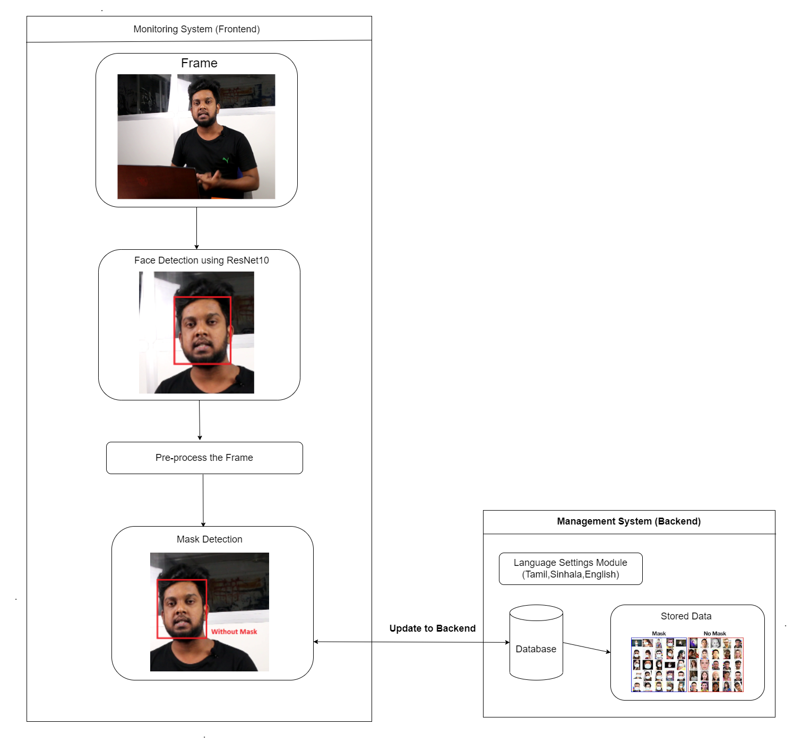
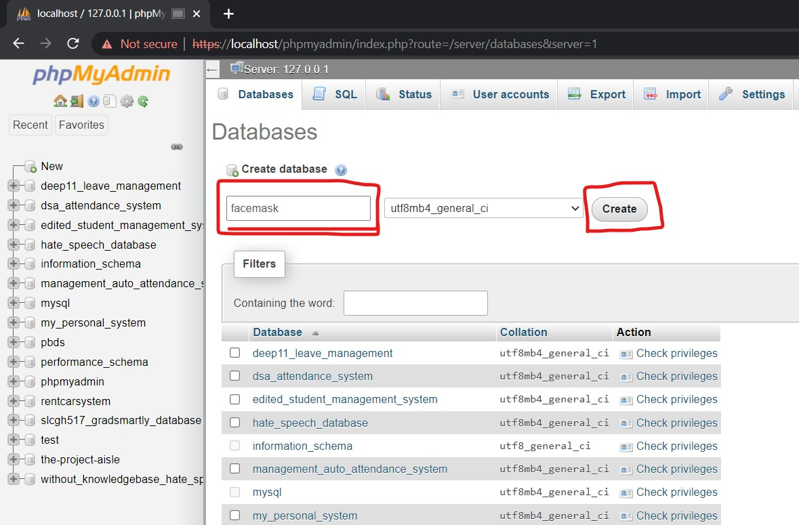
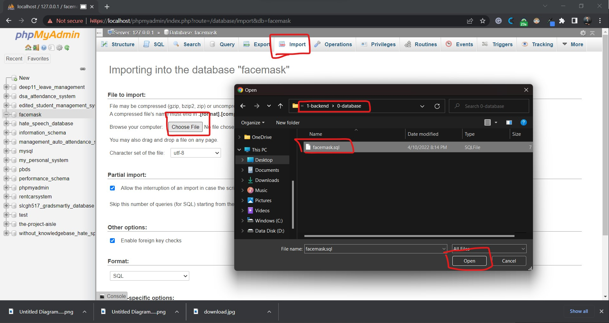
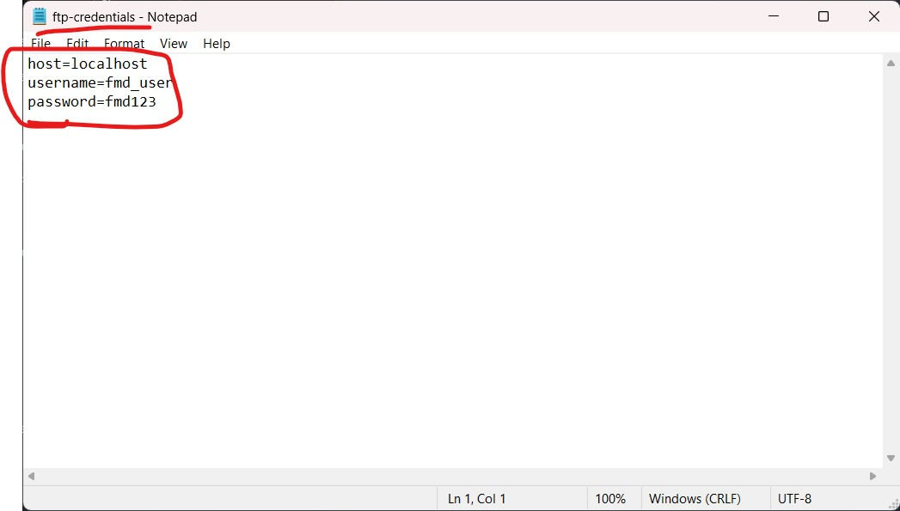
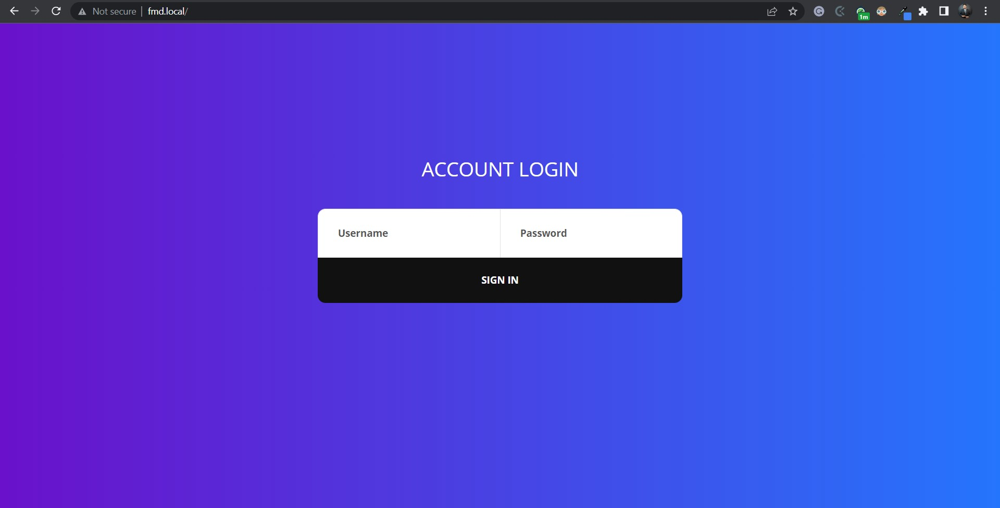
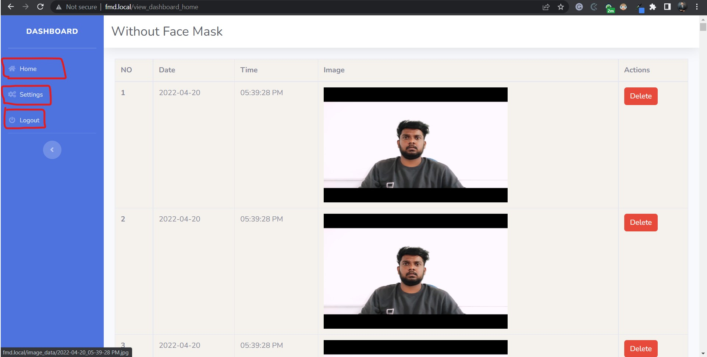
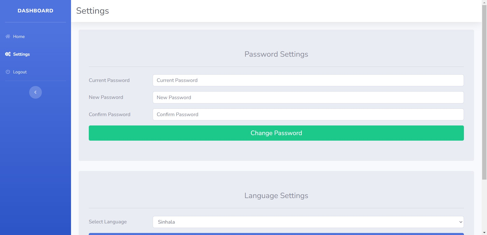
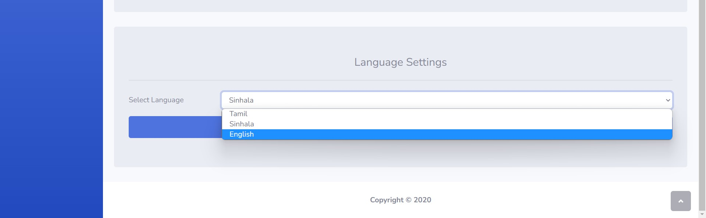

# Covid-19 Face Mask Detector

## Introduction


The covid-19-face-mask-detector is computer vision based system that allows only people who wear a face mask. The primary scope of this project is to restrict people to wear face mask.  


This prototype has two main sections, those are "Management System" that is considered as backend Panel and "Monitoring System" that is considered as frontend.

The backend panel (Management Panel) is written in Laravel framework, the management panel is used to customize the settings such as languages, and also useful for monitoring and data storage.

The frontend (Monitoring System) is written in Python, We use a computer vision and deep neural network to achieve it.

The function of management panel (backend) is to customize system behaviors and store captures data in it, however the function of monitoring system (frontend) is to perform the actual face mask detection, turn on alarm, give voice output warning message in Tamil, Sinhala and English.   


The backend (Management Panel) is the web-based system that keeps records of people who violet the rule by not wearing a mask. It takes snap shots and store it on the database. Then,  the admin can view those stuffs from the backend (Management Panel).

This project has used many programming languages and frameworks such as Laravel, Python, PhP, HTML, JavaScript, Tensorflow, Keras, OpenCV and etc, as a database we are using MySQL.

The FTP server is used to transfer taken photos to backend (Management Panel). So, It is better to have a FTP Sever running on the deployed device.


Video: https://www.facebook.com/gunarakulan/videos/3699395566811987

### Architecture Diagram



## Technology and Frameworks

- **Python** - for monitoring system
- **Laravel** - for backend Panel
- **Tensorflow** - for model training
- **Keras** - for model fine tune and easy model training.
- **OpenCV** - for computer vision
- **Sklearn** - for image preprocessing.


## Setup


### Setup Management System (Backend)


**Step 01**:

- Create an empty database called "facemask"



**Step 02**:

- Import the database from the following directory.

```
covid-19-face-mask-detector\1-backend\0-database\facemask.sql
```




**Step 03**:

- Deploy the backend panel (Management System).

```
covid-19-face-mask-detector\1-backend
```

#### Setup FTP

**Note** We are using FTP to transfer captured photos from frontend to backend (Management Panel).

**Credentials**

- **Host:** localhost
- **Username:** fmd_user
- **Password** fmd123

**To change FTP Credentials**

- Open the "ftp-credentials.txt file" this is found on the following directory (inside the 0-frontend directory) and edit it.

```
covid-19-face-mask-detector\0-frontend\ftp-credentials.txt file
```

**Note** Don't remove the '=' in the middle.





#### Steps to implement a FTP server.

- Point to the image_data folder that is found in the public directory of backend (Management Panel).

**Note:** Point the FTP to the following directory

```
1-facemask-backend-laravel\public\image_data
```

### Setup Monitoring System (Frontend)

* Copy the "0-frontend" folder to the deployed directory.

#### Install Dependencies


```
pip install tensorflow
```

```
pip install opencv-python
```

```
pip install playsound
```

```
pip install imutils
```

```
pip install mysql-connector-python
```

```
pip install keras
```

## Execute the Project

**Run with webcam**

```

python run-with-webcam.py

```


**Run with pre-recorded video**

* Give the video path programmatically by editing the "run-with-video.py".


```

python run-with-video.py

```


**Testing the model**

```

python run-testing.py

```

## Monitoring System Demonstration 


## Management System Demonstration 

### Login Page



- Username: admin
- Password: admin

### Dashboard Home Page



**Note:** The home page stores all of the people' snapshots who did not wear a face mask, the system can delete snapshots via clicking the "Delete" red color button.

### Settings Page

**Note:** The "Settings" page has two main features, one is the change password, the another one is to change the language of the frontend system. Example: When the frontend detects, it speaks out warning message in voice output, we can change that voice language in this setting module.   





**Note:** The language of the voice can be changed in the setting module, Tamil, Sinhala and English languages are available.




## How to Retrain the Model?

* Collect more images of faces with mask and without mask.
* Paste all the with mask images inside the "dataset/with-mask" directory that is found in the frontend.
* Paste all the without mask images inside the "dataset/without-mask" directory that is found in the frontend.
* If it is needed, the neural network (model) can be fine-tuned in the "train-model.py".

```

python train-model.py

```


## Errors & Solutions

### Error:

This page isn’t working localhost is currently unable to handle this request. **HTTP error 500 laravel**.

### Solution:

 - composer install 
 
   ```
    composer update
   ```
- composer update 
   ```
    composer install
   ```


Social Media Links
---

* [Linkedin Profile](https://www.linkedin.com/in/gunarakulangunaretnam/)
* [Facebook Page](https://www.facebook.com/gunarakulangunaretnam)
* [Twitter Profile](https://twitter.com/gunarakulan)
* [Instagram Profile](https://www.instagram.com/gunarakulangunaretnam/)
* [Youtube Channel](https://www.youtube.com/channel/UCMWkED5sabgVZSCKjZuRJXA)

