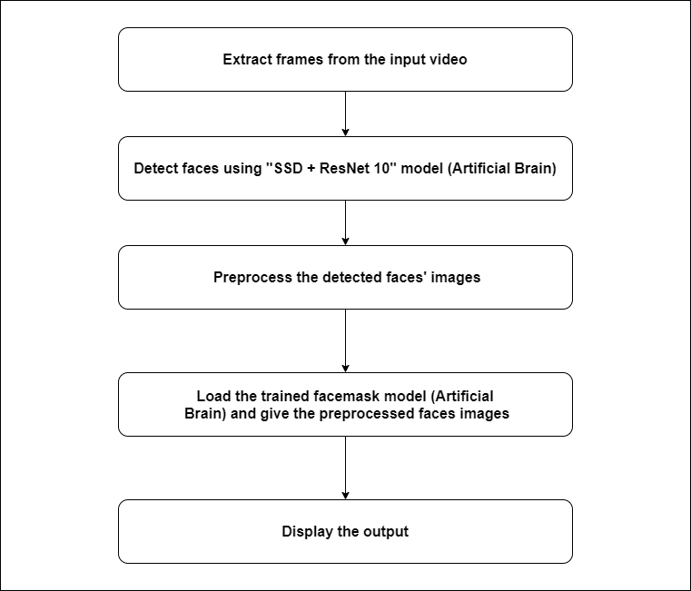

Introduction
---

This covid-19-face-mask-detector is computer vision based system which gives access to people who wear face mask. There are two main sections in it. The first one is the “Management System” which is consider as the backend. It is in written in Laravel. The “Management Panel” is used to customize the settings such as languages and etc. 

The frontend is the machine learning and computer vision part which takes care of detections and alarm voices related things. This system was programmed to make voice (vocals) in Tamil, Sinhala and English.  The language can be changed from the “Management Panel” (backend). 

The backend (Management Panel) is the web-based system which keeps records of people who violet the rule by not wearing a mask. It takes snap shots and store it on the database. Then,  the admin can view those stuffs from the backend (Management Panel). 

This system was written by many programming languages and frameworks such as Laravel, Python, PhP, HTML, JavaScript, Tensorflow, Keras, openCV and etc. This system is using MySQL database to store records.

This system is using FTP server to transfer taken photos to backend (Management Panel). So, It is better to have a FTP Sever running on the deployed device.





Configuration
---

**Backend**

* Import the MySQL Database that is found in the backend folder of this repo.
* Deploy the backend (Management Panel). 


**FTP Setup**

* Create a FTP server which points to the image_data folder that is found in the public directory of backend (Management Panel).
* Setup the username as "fmd_user" and password as "fmd123".
* **Note:-** You can change the password and username of FTP server in the frontend python scripts.


**Frontend**

* Copy the frontend to the deployed directory.
* All scripts are found in the frontend folder.

**Run with webcam**

```

python run-with-webcam.py

```


**Run with pre-recorded video**

* Give the video path programmatically by editing the "run-with-video.py" script that is found the line number of 245.


```

python run-with-video.py

```


**Testing the model**

```

python run-testing.py

```


**Retrain the network (Model)**

* Collect more images of faces with mask and without mask.
* Paste all the with mask images inside the "dataset/with-mask" directory that is found in the frontend.
* Paste all the without mask images inside the "dataset/without-mask" directory that is found in the frontend.
* If it is needed, the neural network (model) can be fine-tuned in the "train-model.py".

```

python train-model.py

```


Any Questions? | Conduct Me 
---

* [Linkedin Profile](https://www.linkedin.com/in/gunarakulan-gunaratnam-161119156/)
* [Facebook Profile](https://www.facebook.com/gunarakulan)
* [Twitter Profile](https://twitter.com/gunarakulang)
* [Instagram Profile](https://www.instagram.com/gunarakulan_gunaratnam/)
* [Youtube Channel](https://www.youtube.com/channel/UCMWkED5sabgVZSCKjZuRJXA/videos)


